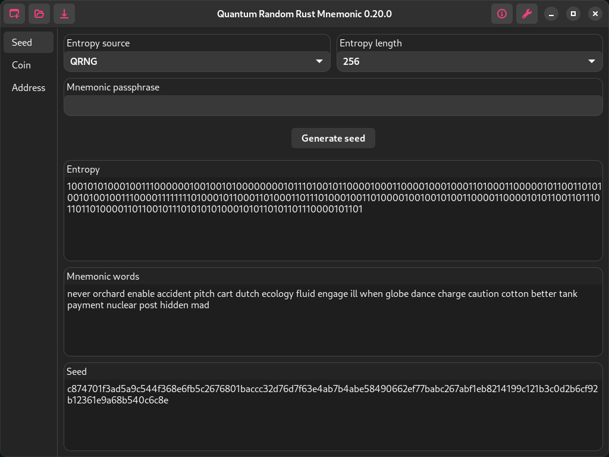
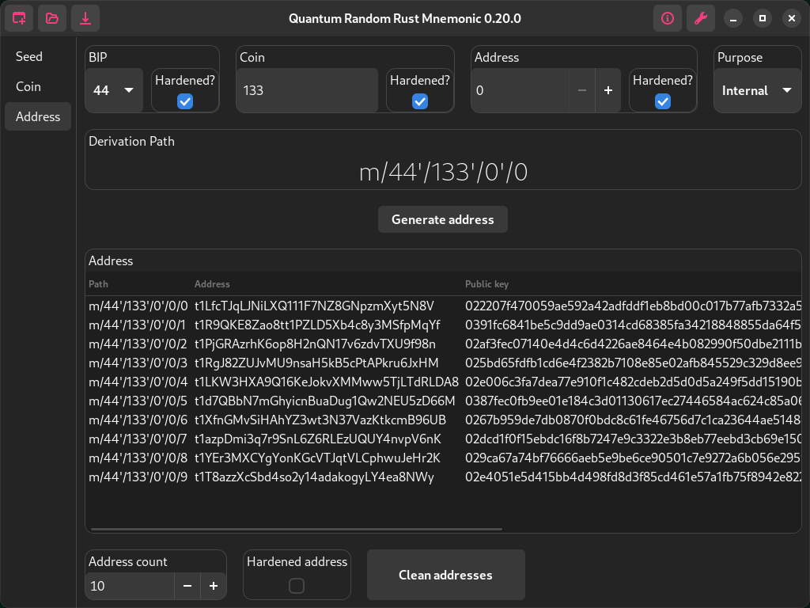

# Quantum Random Rust Mnemonic (QR2M)

```
 ██████╗ ██████╗ ██████╗ ███╗   ███╗
██╔═══██╗██╔══██╗╚════██╗████╗ ████║
██║   ██║██████╔╝ █████╔╝██╔████╔██║
██║▄▄ ██║██╔══██╗██╔═══╝ ██║╚██╔╝██║
╚██████╔╝██║  ██║███████╗██║ ╚═╝ ██║
 ╚══▀▀═╝ ╚═╝  ╚═╝╚══════╝╚═╝     ╚═╝
Quantum Random Rust Mnemonic (0.40.0)
Copyright  [2023-2024]  Control Owl
```

## Beta






## Abstract

This application pioneers the integration of quantum random number generation (QRNG) into cryptocurrency wallet creation, redefining security standards. By harnessing quantum technology, the application ensures private keys are generated with unparalleled unpredictability.

This departure from traditional pseudorandom number generators (PRNG) addresses concerns about cryptographic predictability. The innovation establishes a new standard for robustness in digital asset management. Users can expect heightened security levels and resilience, making this application a trailblazing solution at the forefront of emerging technologies in the cryptocurrency domain.


## Documentation

[Project documentation](doc/)


## Third-Party Libraries

### GTK4

The source code for GTK4 can be obtained from the [GTK project website](https://www.gtk.org/).

GTK4 is licensed under the GNU Lesser General Public License (LGPL) version 2.1 or later, read more [here](/LICENSE-LGPL-2.1.txt).