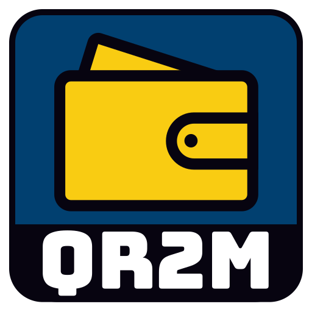

# Quantum Random Rust Mnemonic (QR2M)



```
 ██████╗ ██████╗ ██████╗ ███╗   ███╗
██╔═══██╗██╔══██╗╚════██╗████╗ ████║
██║   ██║██████╔╝ █████╔╝██╔████╔██║
██║▄▄ ██║██╔══██╗██╔═══╝ ██║╚██╔╝██║
╚██████╔╝██║  ██║███████╗██║ ╚═╝ ██║
 ╚══▀▀═╝ ╚═╝  ╚═╝╚══════╝╚═╝     ╚═╝
CC-BY-NC-ND-4.0  [2023-2025]  Control Owl
```

**QR2M** is a **cryptographic key generator** built with **Rust** and **GTK4**. It supports generating secure addresses for +250 crypto coins. Designed with versatility in mind, QR2M allows entropy generation from multiple sources: hardware-based **RNG**, ANU quantum RNG (**QRNG**), and user-provided **files**. While it is not a cryptocurrency wallet yet, it lays the groundwork for potential RPC connection support in future updates. Application is translated to English, German and Croatian.

## License

This project is licensed under a **Creative Commons Attribution Non Commercial No Derivatives 4.0 International license**. Check the [deed](https://creativecommons.org/licenses/by-nc-nd/4.0/deed.en).


## Project status

### I have been trying to compile my app with MUSL since 19 June 2025. No app updates will be carried out until this is complete.

This is currently my main focus, and I want to make my app as portable as possible. The task is very difficult, as I have to precompile **+40 libraries** without any error. Each test takes almost an **hour**, and I only see one error at a time. As soon as I fix it, a new one pops up. It's so annoying that I have to solve the problem in order to sleep well.

| **Security Status**                                                                                                                                                                                       |
|-----------------------------------------------------------------------------------------------------------------------------------------------------------------------------------------------------------|
| [](https://github.com/control-owl/QR2M/actions/workflows/verify-gpg-signature.yml)       |
| [](https://github.com/control-owl/QR2M/actions/workflows/github-code-scanning/codeql) |

| **Build Status**                                                                                                                                                                                                    |
|---------------------------------------------------------------------------------------------------------------------------------------------------------------------------------------------------------------------|
| [](https://github.com/control-owl/QR2M/actions/workflows/release-linux-gnu.yml)             |
| [](https://github.com/control-owl/QR2M/actions/workflows/release-macos-aarch64.yml) |
| [](https://github.com/control-owl/QR2M/actions/workflows/release-linux-musl.yml)              |


## Table of Contents

- [Project Status](#project-status)
- [Features](#features)
- [Installation](#installation)
- [Usage](#usage)
- [Screenshots](#screenshots)
- [Security](#security)
- [Documentation](#documentation)
- [Third-Party Libraries](#third-party-libraries)


## Features

- **Cryptographic Key Generation**: Supports secure generation of addresses for +250 cryptocurrencies.
- **Entropy Sources**:
  - Random Number Generator (RNG)
  - Quantum Random Number Generator (QRNG) from ANU
  - User-supplied files for custom entropy
- **Cross-platform GUI** built with **GTK4** for Linux, macOS and Windows
- **Secure and lightweight**: Written in Rust, ensuring robust performance and security.
- **Really fast**: Generate **7500** addresses per second
- **App versions**: Offline, Full, Dev


## Installation

### Compile: 

- If you want to compile QR2M from a source code, then please check the wiki [How to compile QR2M](https://github.com/control-owl/QR2M/wiki/Installation#how-to-install-qr2m)

### Releases:

- Download official build from [GitHub Releases](https://github.com/control-owl/QR2M/releases)
  - Current builds support:
    - Linux GNU
    - macOS latest
  - Future builds will support:
    - Linux MUSL
    - Flatpak
    - Snap
    - Windows

## Usage

1. **Launch the Application**:
   - Start the app using the provided executable.

2. **Select the Entropy Source**:
   - Choose from the available entropy sources:
      - **RNG+**: Use your system’s random number generator to generate entropy and random mnemonic passphrase
      - **File**: Provide any file to generate entropy.
      - **QRNG**: Utilize a quantum random number generator provided from [ANU (Australian National University)](https://qrng.anu.edu.au/).
         - ANU is disabled in settings by default

3. **Set Entropy Length**:
    - Specify the length of the entropy to be generated based on your chosen entropy source.

4. **Mnemonic Passphrase**:
    - Enter an optional passphrase for added security, which will be used to generate the seed.

5. **Generate Seed**:
    - Press the "New entropy" button to create the cryptographic seed based on your entropy source, length, and passphrase.

6. **Select Cryptocurrency**:
   - On a new tab, choose from the supported cryptocurrencies to generate a master private/public key pair.

7. **Generate Master Keys**:
   - Press the "Generate master keys" button to generate the **Master Private** and **Master Public** keys for the selected cryptocurrency.

8. **Select Address Format**:
   - On the third tab, choose the address format:
     - **BIP**: Select a specific BIP address format.
     - **Address**: Choose from different address path.
     - **Purpose**: Choose to create a internal or external address.
     - **Hardened**: Choose which path to harden.

9. **Generate Address**:
   - After selecting the desired format, generate the address for your chosen cryptocurrency by pressing the button.


## Screenshots

### Generate seed


### Generate master keys


### Generate addresses


### Settings


## Security

To ensure the authenticity and integrity of this application, I've implemented GPG signature verification for both the source code and the final compiled application. Both public keys can be always find in project directory: `res/keys`

### How It Works

- Code Signature: Control Owl [2524C8FEB60EFCB0](https://keys.openpgp.org/search?q=2524C8FEB60EFCB0) – Ensures that the source code in this repository is legitimate and has not been altered.
- Build Signature: QR2M [99204764AC6B6A44](https://keys.openpgp.org/search?q=99204764AC6B6A44) – Ensures that the final compiled application has not been modified after building. This prevents tampering before distribution.


## Documentation

[Wiki](https://github.com/control-owl/QR2M/wiki)


## Support Me

If you like my work, you can buy me a coffee! ☕  

<a href="https://buymeacoffee.com/qr2m">
  
</a>


## Third-Party Libraries

### GTK4

The source code for GTK4 can be obtained from the [GTK project website](https://www.gtk.org/).

GTK4 is licensed under the GNU Lesser General Public License (LGPL) version 2.1 or later, read more [here](./res/licenses/GTK.license).
